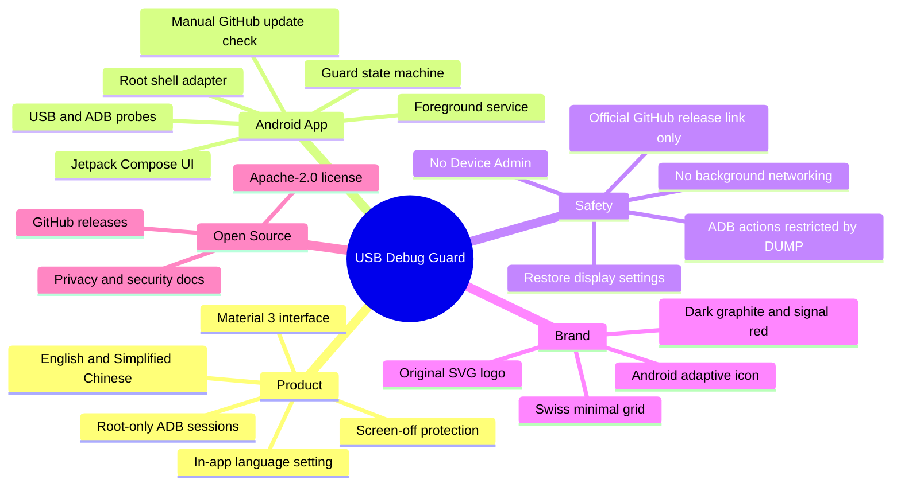

<p align="center">
  
</p>

# USB Debug Guard

Root-only Android screen protection for long USB debugging sessions. It keeps ADB reachable while reducing screen wear, heat, and battery drain.

[简体中文说明](README.zh-CN.md)

## Quick Facts

| Area | Status |
| --- | --- |
| Android support | Android 8.0+ (`minSdk 26`) |
| Build target | Android SDK 36 (`compileSdk 36`, `targetSdk 36`) |
| Verified device | OnePlus CPH2723, Android 15/API 35, arm64, Linux 6.6 Android kernel |
| Root model | Root-only through `su`; no Device Admin |
| Networking | User-initiated GitHub release check only; no analytics or uploads |
| Package | `io.github.nongfsq.usbdebugguard` |
| License | Apache-2.0 |

## What It Does

- Runs a foreground service only after the user enables the guard.
- Detects USB data-session and ADB debugging state through Android APIs.
- Uses root (`su`) to save, change, and restore display settings.
- Opens a persistent safety circuit after the first Root failure instead of retrying indefinitely.
- Checks the official GitHub Releases API only when the user taps **Check updates**.
- Default mode turns the screen off while keeping USB debugging reachable.
- Optional dim-awake fallback keeps the display awake at minimum brightness.
- Restores the previous display state when protection stops or USB disconnects.

## Mindmap



## Visual Identity

The logo is an original geometric mark, not a third-party icon. The design direction is inspired by Swiss International Style and Red Dot-caliber industrial minimalism: strict geometry, high contrast, restrained color, and one clear signal accent.

- Primary source: [docs/assets/logo.svg](docs/assets/logo.svg)
- Horizontal lockup: [docs/assets/logo-lockup.svg](docs/assets/logo-lockup.svg)
- Social preview source: [docs/assets/social-preview.svg](docs/assets/social-preview.svg)
- Android launcher icon: adaptive icon derived from the same USB-C port, white data rail, and red guard indicator.
- Notification icon: single-color vector for Android status bar rendering.

For UI icons, the app uses Material Icons through Compose. Future icon options worth reviewing are Material Symbols, Lucide, Heroicons, and Phosphor Icons, but the app logo should stay original so the project has a clear identity and no icon-pack licensing ambiguity.

## Language Packs

USB Debug Guard ships English and Simplified Chinese resources. The app language can be set inside the app:

- Follow system
- English
- Simplified Chinese

On Android 13 and newer, the app also registers its supported locales through `locale_config`, so system-level app language controls can understand the available language packs.

## Compatibility

USB Debug Guard is not split by CPU architecture or Android kernel version. The APK is a universal Android package built from Kotlin, Jetpack Compose, and AndroidX dependencies. Compatibility mostly depends on Android API level, root behavior, and available system commands rather than on the Linux kernel alone.

Expected environment:

- Android 8.0 or newer.
- A working `su` implementation from a root manager such as Magisk or KernelSU.
- Root can run `settings`, `input`, and optionally `wm`.
- USB data state can be detected through Android's USB state broadcast.

Root does not guarantee every device behaves the same way. OEM firmware, SELinux policy, root manager prompts, USB power reporting, and lock-screen behavior can all affect results.

## Build

Install Android SDK 36, then run:

```sh
./gradlew assembleDebug
```

Windows helper:

```powershell
.\tools\build.ps1
```

The debug APK is created at:

```text
app\build\outputs\apk\debug\app-debug.apk
```

For a release build:

```powershell
.\gradlew.bat assembleRelease
```

## Install

```powershell
.\tools\install.ps1 -Serial emulator-5580
```

Or install manually:

```powershell
adb -s emulator-5580 install -r app\build\outputs\apk\debug\app-debug.apk
```

## ADB Control

The foreground service exposes shell-only actions guarded by `android.permission.DUMP`:

```powershell
adb shell am start-foreground-service -a io.github.nongfsq.usbdebugguard.action.START -n io.github.nongfsq.usbdebugguard/.GuardService
adb shell am startservice -a io.github.nongfsq.usbdebugguard.action.STOP -n io.github.nongfsq.usbdebugguard/.GuardService
adb shell am startservice -a io.github.nongfsq.usbdebugguard.action.REFRESH -n io.github.nongfsq.usbdebugguard/.GuardService
```

## Project Layout

| Path | Purpose |
| --- | --- |
| `app/src/main/kotlin/io/github/nongfsq/usbdebugguard` | Kotlin app source, foreground service, root state machine, USB and ADB probes. |
| `app/src/main/res` | Android resources, strings, Material theme, launcher and notification icons. |
| `app/src/main/res/values`, `values-zh-rCN` | English and Simplified Chinese language packs. |
| `docs/assets` | SVG brand sources and generated raster assets for GitHub or release pages. |
| `docs/release-notes` | Bilingual release notes used by GitHub releases. |
| `tools` | Windows-friendly build and install helpers. |
| `gradle/wrapper` | Checked-in Gradle wrapper for reproducible builds. |

## README Techniques

This README deliberately uses a few maintainable documentation tools:

- Mermaid mindmap for architecture and product shape.
- SVG brand assets so GitHub can render crisp graphics without binary-only sources.
- Tables for compatibility, project layout, and release facts.
- Bilingual docs instead of machine-translated fragments.
- Release notes kept in `docs/release-notes` so GitHub releases and repository docs stay aligned.

## Privacy

USB Debug Guard does not collect analytics or upload logs. Network access occurs only after the user taps **Check updates**, and is limited to the official GitHub Releases API and release page. See [PRIVACY.md](PRIVACY.md).

## Security

This is a root-only tool. Review what the app does before granting root access. See [SECURITY.md](SECURITY.md).

## License

Apache License 2.0. See [LICENSE](LICENSE).
