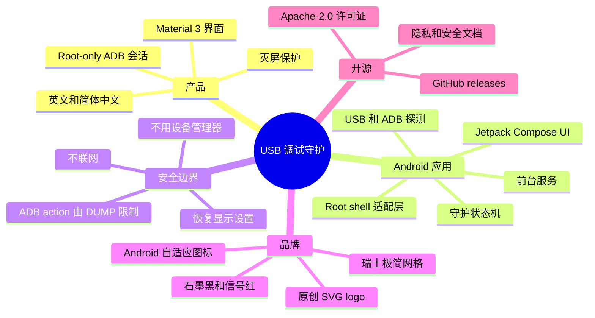

<p align="center">
  
</p>

# USB 调试守护

面向长时间 USB 调试的 root-only Android 屏幕保护工具。它会尽量保持 ADB 可访问，同时降低屏幕损耗、发热和耗电。

[English README](README.md)

## 快速信息

| 项目 | 状态 |
| --- | --- |
| Android 支持 | Android 8.0+ (`minSdk 26`) |
| 构建目标 | Android SDK 36 (`compileSdk 36`, `targetSdk 36`) |
| 已验证设备 | OnePlus CPH2723，Android 15/API 35，arm64，Linux 6.6 Android 内核 |
| Root 模型 | 只依赖 root (`su`)，不使用设备管理器 |
| 网络 | 无联网权限，无统计，无上传 |
| 包名 | `io.github.nongfsq.usbdebugguard` |
| 许可证 | Apache-2.0 |

## 功能

- 仅在用户启用守护后运行前台服务。
- 检测 USB 供电状态和 ADB 调试状态。
- 使用 root (`su`) 保存、修改和恢复显示设置。
- 默认模式会在守护时灭屏，同时保持 USB 调试可访问。
- 备用的低亮常亮模式会把亮度降到最低并保持屏幕唤醒。
- 停止守护或 USB 断开后恢复原显示状态。

## Mindmap



## 视觉系统

Logo 是原创几何标识，不依赖第三方图标包。设计方向参考瑞士国际主义平面风格和红点奖级别的工业极简：严格几何、高对比、克制配色，只保留一个明确的红色信号点。

- 主源文件：[docs/assets/logo.svg](docs/assets/logo.svg)
- 横向组合：[docs/assets/logo-lockup.svg](docs/assets/logo-lockup.svg)
- 社交预览源文件：[docs/assets/social-preview.svg](docs/assets/social-preview.svg)
- Android 启动图标：由同一套盾牌、调试总线、灭屏横线几何派生。
- 通知图标：单色 vector，适配 Android 状态栏渲染。

UI 图标目前使用 Compose 的 Material Icons。后续可以评估 Material Symbols、Lucide、Heroicons、Phosphor Icons 等高质量图标库，但 app logo 应保持原创，避免图标包授权和项目识别度问题。

## 兼容性

USB 调试守护不按 CPU 架构或 Android 内核版本拆分包。APK 是通用 Android 包，由 Kotlin、Jetpack Compose 和 AndroidX 依赖构建。实际兼容性主要取决于 Android API、root 行为和系统命令可用性，而不是单纯取决于 Linux 内核版本。

预期环境：

- Android 8.0 或更新版本。
- 来自 Magisk、KernelSU 等 root 管理器的可用 `su`。
- root 环境中可运行 `settings`、`input`，以及可选的 `wm`。
- USB 状态可以通过 Android API 或 root 可读的 sysfs 路径检测。

Root 不代表所有设备都 100% 兼容。OEM 系统、SELinux 策略、root 授权弹窗、USB 供电状态上报、锁屏行为都可能影响结果。

## 构建

安装 Android SDK 36，然后运行：

```powershell
.\tools\build.ps1
```

调试 APK 会生成在：

```text
app\build\outputs\apk\debug\app-debug.apk
```

Release 构建：

```powershell
.\gradlew.bat assembleRelease
```

## 安装

```powershell
.\tools\install.ps1
```

或者手动安装：

```powershell
adb install -r app\build\outputs\apk\debug\app-debug.apk
```

## ADB 控制

前台服务暴露仅 shell 可调用的 action，并通过 `android.permission.DUMP` 限制普通第三方应用调用：

```powershell
adb shell am start-foreground-service -a io.github.nongfsq.usbdebugguard.action.START -n io.github.nongfsq.usbdebugguard/.GuardService
adb shell am startservice -a io.github.nongfsq.usbdebugguard.action.STOP -n io.github.nongfsq.usbdebugguard/.GuardService
adb shell am startservice -a io.github.nongfsq.usbdebugguard.action.REFRESH -n io.github.nongfsq.usbdebugguard/.GuardService
```

## 项目目录

| 路径 | 用途 |
| --- | --- |
| `app/src/main/kotlin/io/github/nongfsq/usbdebugguard` | Kotlin 应用源码、前台服务、root 状态机、USB 和 ADB 探测。 |
| `app/src/main/res` | Android 资源、字符串、Material 主题、启动图标和通知图标。 |
| `docs/assets` | SVG 品牌源文件，以及供 GitHub 或 release 页面使用的栅格图。 |
| `docs/release-notes` | GitHub release 使用的中英文发布说明。 |
| `tools` | 适合 Windows 环境的构建和安装脚本。 |
| `gradle/wrapper` | 已提交的 Gradle Wrapper，用于可复现构建。 |

## README 写法

这个 README 使用了几种可维护的文档技术：

- Mermaid mindmap 用来表达产品结构和技术边界。
- SVG 品牌资产保证 GitHub 上清晰渲染，同时保留可编辑源文件。
- 表格用于兼容性、目录结构、发布信息，方便快速扫描。
- 中英文分别维护，避免混杂式机器翻译。
- 发布说明放在 `docs/release-notes`，让 GitHub release 和仓库文档保持一致。

## 隐私

USB 调试守护不收集分析数据、不联网、不上传日志，也不保存个人信息。详见 [PRIVACY.md](PRIVACY.md)。

## 安全

这是一个 root-only 工具。授予 root 权限前，请先确认它会做什么。详见 [SECURITY.md](SECURITY.md)。

## 许可证

Apache License 2.0。详见 [LICENSE](LICENSE)。
